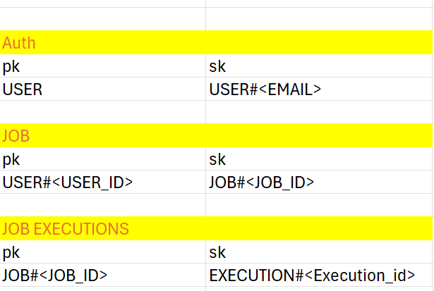

# Background Job Scheduler
 
A scalable, background job scheduling system built with FastAPI and AWS serverless architecture. This system enables users to schedule and execute recurring or one-time tasks such as email notifications with robust monitoring and failure handling capabilities.

## Statement
- The Background Job Scheduler System is a backend platform that allows users to schedule and execute background tasks reliably.

- The system supports one-time and recurring jobs, tracks execution status, handles retries and failures, and maintains detailed execution logs for debugging purpose.
 
 
## Architecture
 
### High-Level Architecture
 
The system consists of three main components:
 
1. **REST API Service** - FastAPI application for job management and user authentication
2. **Job Worker** - Lambda function that processes scheduled jobs from SQS queue
3. **DLQ Handler** - Lambda function that handles failed job executions
 
### Infrastructure Components
 
- **Application Layer**: FastAPI REST API deployed on AWS ECS Fargate
- **Job Scheduling**: AWS EventBridge Scheduler for triggering jobs
- **Message Queue**: Amazon SQS for job distribution and retry handling
- **Compute**: AWS Lambda for serverless job execution
- **Storage**: Amazon DynamoDB for job and execution records
- **Logging**: Amazon S3 for execution logs
- **Email Service**: Amazon SES for sending email notifications
- **Load Balancing**: Application Load Balancer for distributing API traffic
 
### Data Flow
 
1. **Job Creation Flow**:
   - User authenticates via JWT token
   - User creates a job via REST API (POST /v1/jobs)
   - API validates job schedule and creates EventBridge Scheduler rule
   - Job metadata stored in DynamoDB
   - EventBridge Scheduler configured to send messages to SQS queue
 
2. **Job Execution Flow**:
   - EventBridge Scheduler triggers at scheduled time
   - Message sent to SQS job queue
   - Lambda worker receives message from SQS
   - Worker retrieves job details from DynamoDB
   - Worker executes task (e.g., send email via SES)
   - Execution status and logs stored in DynamoDB and S3
   - On success, message deleted from queue
 
3. **Failure Handling Flow**:
   - Failed messages retry up to 3 times
   - After max retries, message moved to Dead Letter Queue (DLQ)
   - DLQ Handler Lambda processes failed jobs
   - Job execution status updated to PERMANENTLY FAILED in DynamoDB
 
## Features
 
- **User Authentication**: JWT-based authentication and authorization
- **Flexible Scheduling**: Support for one-time (AT) and recurring (CRON, INTERVAL) schedules
- **Job Management**: Create, retrieve, and delete scheduled jobs
- **Execution Tracking**: Monitor job execution history 
- **Retry Mechanism**: Automatic retry with configurable max attempts
- **Failure Handling**: Dead Letter Queue for failed job processing
- **Task Types**: Support for various task types including employee notifications
- **Scalable Architecture**: Serverless design for automatic scaling
- **Comprehensive Logging**: S3-based log storage for execution analysis
 
## Technology Stack
 
### Backend
- **Framework**: FastAPI 0.128.0
- **Language**: Python 3.10
- **Authentication**: JWT (PyJWT 2.10.1)
- **Password Hashing**: bcrypt 5.0.0
- **Data Validation**: Pydantic 2.12.5
- **Testing**: pytest 9.0.2, pytest-cov 7.0.0
 
### AWS Services
- **Compute**: AWS Lambda, ECS Fargate
- **Scheduling**: EventBridge Scheduler
- **Messaging**: Amazon SQS
- **Database**: Amazon DynamoDB
- **Storage**: Amazon S3
- **Email**: Amazon SES
- **Load Balancing**: Application Load Balancer
- **IAM**: Role-based access control
 
### Infrastructure as Code
- **AWS SAM**: Serverless application deployment
- **CloudFormation**: Infrastructure provisioning
- **Docker**: Container packaging
 
## Project Structure
 
```
Background_Job_scheduler/
├── application/               # FastAPI REST API service
│   ├── src/
│   │   ├── api/              # API route handlers
│   │   ├── services/         # Business logic layer
│   │   ├── repositories/     # Data access layer
│   │   ├── schemas/          # Pydantic schemas
│   │   ├── models/           # Domain models
│   │   ├── enums/            # Enumeration types
│   │   ├── helper/           # Utility functions
│   │   ├── core/             # AWS clients and config
│   │   └── errors/           # Exception handling
│   ├── tests/                # Unit and integration tests
│   ├── dockerfile            # Container image definition
│   └── requirements.txt      # Python dependencies
│
├── serverless/               # Lambda functions
│   ├── lambda_worker/        # Job execution worker
│   │   ├── handler.py        # Lambda entry point
│   │   ├── services/         # Email, logging services
│   │   ├── repositories/     # DynamoDB access
│   │   └── tests/            # Lambda tests
│   ├── lambda_dlq_handler/   # DLQ processing
│   └── template.yaml         # SAM template
│
└── deploy/                   # Infrastructure templates
    ├── job_scheduler_queue.yaml    # SQS setup
    ├── dynamo_db_cfn/              # DynamoDB tables
    └── ecs_farget_cfn/             # ECS Fargate deployment
```
 
## API Endpoints
 
### Authentication
- `POST /v1/auth/signup` - Register new user
- `POST /v1/auth/login` - User login and JWT token generation
 
### Jobs
- `POST /v1/jobs` - Create a new scheduled job
- `GET /v1/jobs/{job_id}` - Retrieve job details
- `GET /v1/jobs/{job_id}/executions` - Get job execution history
- `DELETE /v1/jobs/{job_id}` - Delete a scheduled job
- `PATCH /v1/jobs/{job_id}/activate` -  Activate scheduled job
- `PATCH /v1/jobs/{job_id}/deactivate` -  Deactivate scheduled job

 
### Health Check
- `GET /health` - Service health status
 
## Job Configuration
 
### Job Types
- **ONE_TIME**: Job executes once at specified time
- **RECURRING**: Job executes repeatedly based on schedule
 
### Schedule Types
- **AT**: Execute at specific timestamp (ISO 8601 format)
- **CRON**: Execute based on cron expression (6-field format)
- **INTERVAL**: Execute at regular intervals
 
### Task Types
- **EMPLOYEE_ONE_TIME_NOTIFICATION**: Single email notification
- **EMPLOYEE_RECURRING_REMINDER**: Recurring email reminders
 
## Database Schema
 
### DynamoDB Table: Job_Records
 
The system uses a single-table design with composite keys:

 
 
**Access Patterns**:
- Create new user
- Login by Email
- Get job by user and job ID
- List all jobs for a user
- Get execution details for a job by job id
- Delete the scheduled job by user id and job id
- Deactivate the scheduled job by user and job id
- Activate the scheduled job by user and job id
 
## Deployment
 
### Prerequisites
- AWS Account with appropriate permissions
- AWS CLI configured
- SAM CLI installed
- Docker installed
- Python 3.10+
 
### Deploy Infrastructure
 
1. **Deploy DynamoDB Table**:
```bash
aws cloudformation deploy \
  --template-file deploy/dynamo_db_cfn/create_dynamo_db_table.yaml \
  --stack-name bg-job-dynamodb
```
 
2. **Deploy SQS Queues**:
```bash
aws cloudformation deploy \
  --template-file deploy/job_scheduler_queue.yaml \
  --stack-name bg-job-sqs
```
 
3. **Deploy Lambda Functions**:
```bash
cd serverless
sam build
sam deploy --guided
```
 
4. **Deploy ECS Fargate Service**:
```bash
aws cloudformation deploy \
  --template-file deploy/ecs_farget_cfn/template.yaml \
  --stack-name bg-job-api \
  --parameter-overrides \
    VpcId=<vpc-id> \
    SubnetIds=<subnet-ids> \
    ContainerImage=<ecr-image-uri> \
  --capabilities CAPABILITY_IAM
```
 
## Configuration
 
### Environment Variables
 
**Application Service**:
- `JWT_SECRET_KEY`: Secret key for JWT token signing
- `JWT_ALGORITHM`: Algorithm for JWT encoding (default: HS256)
- `JWT_EXPIRY_TIME`: Token expiry time in hours
- `DYNAMO_TABLE_NAME`: DynamoDB table name
- `JOB_QUEUE_ARN`: SQS queue ARN
- `EVENT_BRIDGE_ROLE_ARN`: IAM role for EventBridge
- `SCHEDULE_GROUP_NAME`: EventBridge scheduler group
 
**Lambda Worker**:
- `LOG_BUCKET`: S3 bucket for execution logs
- `DYNAMO_TABLE_NAME`: DynamoDB table name
 
## Testing
 
### Run Unit Tests
```bash
cd application
pytest tests/ -v
```
 
### Run Tests with Coverage
```bash
pytest tests/ --cov=src --cov-report=html
```
 
### Lambda Function Tests
```bash
cd serverless/lambda_worker
pytest tests/ -v
```
 
## Monitoring and Logging
 
- **CloudWatch Logs**: Lambda execution logs and API logs
- **S3 Logs**: Detailed job execution logs stored in S3
- **DynamoDB**: Execution status and retry count tracking
- **CloudWatch Metrics**: Lambda invocations
 
## Error Handling
 
The system implements comprehensive error handling:
 
- **Validation Errors**: Input validation with detailed error messages
- **Authentication Errors**: JWT token validation and expiry handling
- **Execution Errors**: Retry mechanism with exponential backoff
- **Dead Letter Queue**: Separate processing for failed jobs
- **Application Exceptions**: Custom exception hierarchy with error codes
 
## Security
 
- **Authentication**: JWT-based token authentication
- **Authorization**: User-scoped job access control
- **Password Security**: bcrypt hashing for user passwords
- **IAM Roles**: Least privilege access for AWS services
- **CORS**: Configurable cross-origin resource sharing
- **Secrets Management**: Sensitive data stored in environment variables
 
## Scalability
 
- **Auto-scaling**: ECS Fargate auto-scaling based on CPU/memory
- **Lambda Concurrency**: Automatic scaling for job execution
- **SQS Batching**: Batch processing for improved throughput
- **DynamoDB**: On-demand capacity for automatic scaling
- **Stateless Design**: Horizontal scaling without session management
 